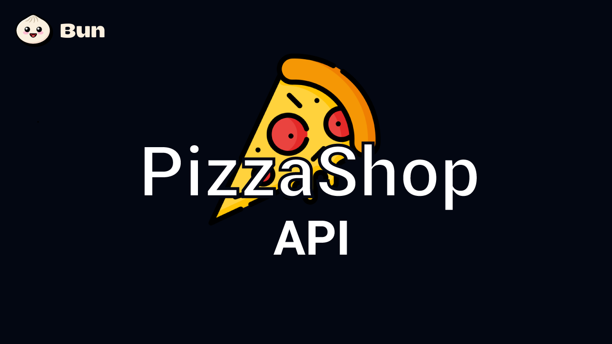

# PizzaShop API

## ✒️ Descrição

Desenvolvimento de uma API para um painel de gerenciamento de pedidos, focando nas funcionalidades para o gerente da loja, como acompanhar pedidos, alterar status, métricas, gráficos e listagens Utilizando o Bun como tecnologia no back-end e o framework ElysiaJS.

## 🚀 Tecnologias utilizadas

 

## 📷 Demostração

Apresentação da tela do aplicativo.

## 🔥 Instalação

(Em breve)

## 📝 Licença

Esse projeto está sob a licença MIT. Veja o arquivo [LICENSE](https://www.notion.so/LICENSE) para mais detalhes.

---

Desenvolvido por - <a href="https://github.com/vian4dev">Gabriel Viana</a> 🤖

